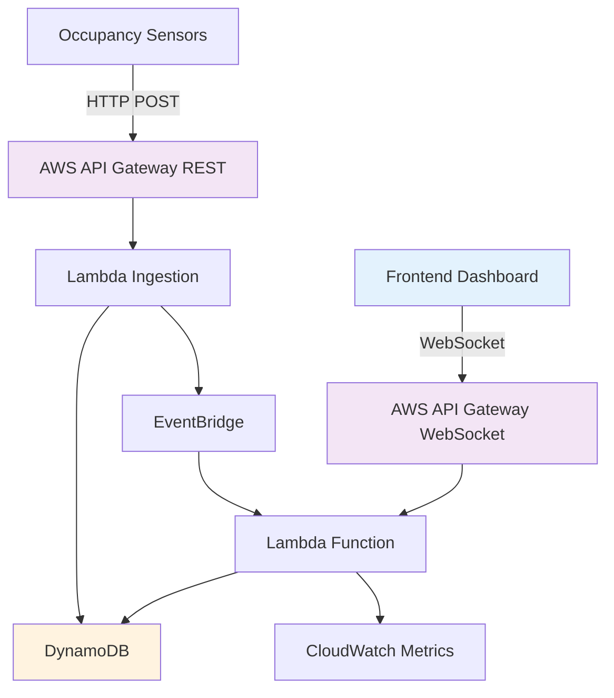
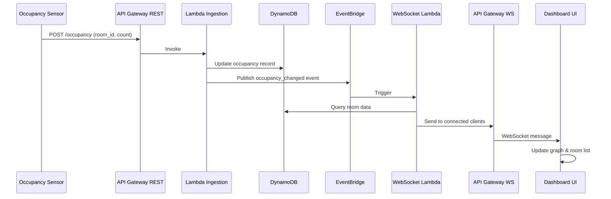
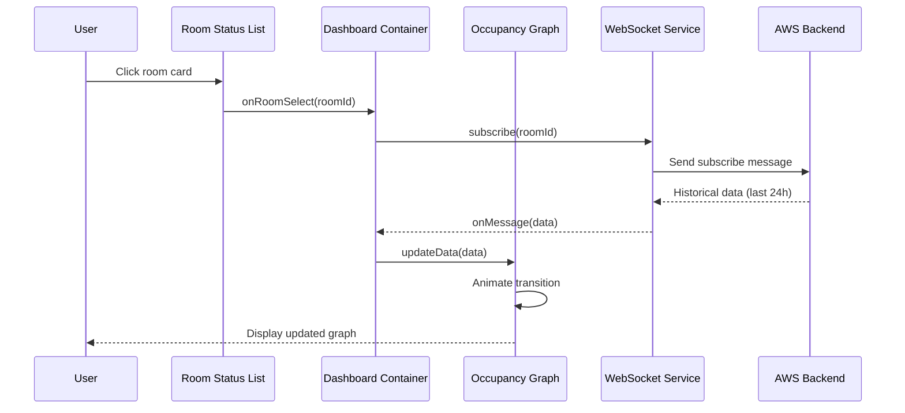

# Design Document: Room Occupancy Dashboard

## Overview

The Room Occupancy Dashboard is a real-time monitoring interface that displays occupancy levels across multiple rooms. The feature consists of a centered dashboard with Apple-inspired minimalist aesthetics, featuring a primary time-series graph with a lime green line and gradient fill tracking occupancy in a selected room, plus a room status list showing color-coded occupancy levels (green for relatively empty, yellow for moderately full, red for mostly full). The frontend connects to an AWS backend database via WebSocket for real-time updates.

The design prioritizes clean visual hierarchy, smooth animations, and responsive real-time data visualization while maintaining a simple, elegant user experience consistent with Apple's design language.

## Architecture



## Components and Interfaces

### Component 1: Dashboard Container

**Purpose**: Main container component that orchestrates the layout and manages global state

**Interface**:

```typescript
interface DashboardContainer {
  selectedRoomId: string | null
  rooms: Room[]
  occupancyData: OccupancyDataPoint[]
  
  onRoomSelect(roomId: string): void
  connectWebSocket(): void
  disconnectWebSocket(): void
}
```

**Responsibilities**:

- Manage WebSocket connection lifecycle
- Coordinate data flow between child components
- Handle room selection state
- Apply Apple-style centered layout with appropriate spacing

### Component 2: OccupancyGraph

**Purpose**: Renders the time-series graph with lime green line and gradient fill

**Interface**:

```typescript
interface OccupancyGraph {
  data: OccupancyDataPoint[]
  roomName: string
  maxCapacity: number
  
  render(): void
  updateData(newPoint: OccupancyDataPoint): void
  animateTransition(): void
}
```

**Responsibilities**:

- Render SVG-based line chart with smooth curves
- Apply lime green (#32CD32 or similar) stroke with gradient fill
- Animate data point transitions smoothly
- Display time axis (x) and occupancy count axis (y)
- Show current occupancy value prominently
- Handle responsive sizing

### Component 3: RoomStatusList

**Purpose**: Displays scrollable list of rooms with color-coded status indicators

**Interface**:

```typescript
interface RoomStatusList {
  rooms: Room[]
  selectedRoomId: string | null
  
  onRoomClick(roomId: string): void
  getStatusColor(occupancyPercentage: number): StatusColor
  render(): void
}
```

**Responsibilities**:

- Render list of room cards with status indicators
- Calculate occupancy percentage for color coding
- Handle room selection interactions
- Apply hover and selection states with smooth transitions
- Display room name, current count, and capacity

### Component 4: WebSocketService

**Purpose**: Manages real-time connection to AWS backend

**Interface**:
```typescript
interface WebSocketService {
  connectionUrl: string
  isConnected: boolean
  
  connect(): Promise<void>
  disconnect(): void
  subscribe(roomId: string): void
  unsubscribe(roomId: string): void
  onMessage(callback: (data: OccupancyUpdate) => void): void
  onError(callback: (error: Error) => void): void
}
```

**Responsibilities**:
- Establish and maintain WebSocket connection to AWS API Gateway
- Handle reconnection logic with exponential backoff
- Subscribe to specific room updates
- Parse incoming messages and trigger callbacks
- Handle connection errors gracefully

## Data Models

### Model 1: Room

```typescript
interface Room {
  id: string
  name: string
  currentOccupancy: number
  maxCapacity: number
  lastUpdated: Date
  status: RoomStatus
}

enum RoomStatus {
  EMPTY = 'empty',
  MODERATE = 'moderate',
  FULL = 'full'
}
```

**Validation Rules**:
- `id` must be non-empty string
- `name` must be non-empty string
- `currentOccupancy` must be non-negative integer
- `maxCapacity` must be positive integer
- `currentOccupancy` must not exceed `maxCapacity`
- `status` calculated as: 0-40% = EMPTY (green), 41-75% = MODERATE (yellow), 76-100% = FULL (red)

### Model 2: OccupancyDataPoint

```typescript
interface OccupancyDataPoint {
  timestamp: Date
  count: number
  roomId: string
}
```

**Validation Rules**:
- `timestamp` must be valid Date object
- `count` must be non-negative integer
- `roomId` must reference valid Room
- Data points should be ordered chronologically

### Model 3: OccupancyUpdate

```typescript
interface OccupancyUpdate {
  type: 'occupancy_change' | 'room_status'
  roomId: string
  data: {
    currentOccupancy: number
    timestamp: string
    changeType?: 'entry' | 'exit'
  }
}
```

**Validation Rules**:
- `type` must be valid enum value
- `roomId` must be non-empty string
- `data.currentOccupancy` must be non-negative integer
- `data.timestamp` must be ISO 8601 format string

### Model 4: WebSocketMessage

```typescript
interface WebSocketMessage {
  action: 'subscribe' | 'unsubscribe' | 'ping'
  roomId?: string
  timestamp: string
}
```

**Validation Rules**:
- `action` must be valid enum value
- `roomId` required for subscribe/unsubscribe actions
- `timestamp` must be ISO 8601 format string

## Sequence Diagrams

### Real-Time Occupancy Update Flow



### User Room Selection Flow



## Correctness Properties

*A property is a characteristic or behavior that should hold true across all valid executions of a system-essentially, a formal statement about what the system should do. Properties serve as the bridge between human-readable specifications and machine-verifiable correctness guarantees.*

### Property 1: Occupancy Bounds

For all rooms r, at all times t: `0 ≤ r.currentOccupancy ≤ r.maxCapacity`

**Validates: Requirements 7.1, 7.2**

### Property 2: Status Color Consistency

For all rooms r and any occupancy/capacity ratio, the status color calculation should return exactly one of green (≤40%), yellow (41-75%), or red (>75%) based on the occupancy percentage

**Validates: Requirements 3.1, 3.2, 3.3**

### Property 3: Data Point Ordering

For all consecutive data points d₁, d₂ in occupancyData: `d₁.timestamp < d₂.timestamp`

**Validates: Requirement 2.2**

### Property 4: Occupancy Update Reflection

For any occupancy update received, the Dashboard should reflect the new occupancy count in both the room list and graph (if selected) without requiring user action

**Validates: Requirements 1.2, 3.4**

### Property 5: Room Display Completeness

For any room displayed in the Dashboard, both the current occupancy count and maximum capacity should be visible to the user

**Validates: Requirement 1.3**

### Property 6: Historical Data Window

For any room selected, the occupancy graph should display only data points from the last 24 hours

**Validates: Requirements 2.1, 10.3**

### Property 7: Room Selection Graph Update

For any room r selected by the user, the occupancy graph should display data specific to room r and no other room

**Validates: Requirements 4.1, 4.3**

### Property 8: Room Selection Highlighting

For any room r selected by the user, room r should be visually highlighted in the room list and no other room should be highlighted

**Validates: Requirement 4.2**

### Property 9: Room Selection Persistence

For any room r selected during a user session, the selection should persist until the user selects a different room or closes the dashboard

**Validates: Requirement 4.4**

### Property 10: WebSocket Subscription Round-Trip

For any room r, subscribing to room r then unsubscribing from room r should return the subscription state to its original condition

**Validates: Requirements 5.2, 5.3**

### Property 11: Connection Resilience

For any WebSocket connection failure, the system should attempt reconnection with exponential backoff delays (1s, 2s, 4s, 8s, ...) capped at maximum 30 seconds

**Validates: Requirements 6.1, 6.2**

### Property 12: Connection Loss Notification

For any WebSocket connection loss event, a "Connection lost" notification should be displayed to the user

**Validates: Requirement 6.3**

### Property 13: Connection Recovery

For any WebSocket connection restoration after a loss, the notification should be removed and real-time updates should resume

**Validates: Requirement 6.4**

### Property 14: Cached Data During Disconnection

For any period while the WebSocket connection is unavailable, the Dashboard should display the most recent cached data along with the timestamp of the last successful update

**Validates: Requirement 6.5**

### Property 15: Invalid Data Rejection

For any occupancy update with invalid data (negative count or count exceeding capacity), the Dashboard should reject the update and maintain the previous valid state

**Validates: Requirements 7.1, 7.2, 7.3**

### Property 16: Invalid Data Logging

For any invalid occupancy update received, an error should be logged to the system monitoring infrastructure

**Validates: Requirement 7.4**

### Property 17: Unavailable Room Handling

For any selected room that becomes unavailable in the backend, the Dashboard should display a "Room unavailable" message and automatically select the first available room

**Validates: Requirements 9.1, 9.3**

### Property 18: Room List Refresh on Availability Change

For any change in room availability (room added or removed), the Dashboard should refresh the room list from the backend

**Validates: Requirement 9.2**

### Property 19: Update Rate Limiting

For any room receiving rapid occupancy updates, the Dashboard should process at most 10 updates per second for that room

**Validates: Requirement 10.2**

## Error Handling

### Error Scenario 1: WebSocket Connection Failure

**Condition**: Initial connection to AWS API Gateway WebSocket fails
**Response**: Display non-intrusive notification banner at top of dashboard with "Connection lost" message
**Recovery**: Automatically retry connection with exponential backoff; show "Reconnecting..." status

### Error Scenario 2: Invalid Occupancy Data

**Condition**: Received occupancy count exceeds room capacity or is negative
**Response**: Log error to console, reject the update, maintain previous valid state
**Recovery**: Request fresh data from backend; display warning icon on affected room card

### Error Scenario 3: Backend Service Unavailable

**Condition**: AWS backend returns 503 or times out
**Response**: Display cached data with timestamp showing last successful update
**Recovery**: Continue retry attempts; show "Using cached data" indicator

### Error Scenario 4: Room Not Found

**Condition**: User selects room that no longer exists in backend
**Response**: Display "Room unavailable" message in graph area
**Recovery**: Refresh room list from backend; auto-select first available room

## Testing Strategy

### Unit Testing Approach

Test each component in isolation using React Testing Library or similar:
- OccupancyGraph: Test data rendering, gradient application, animation triggers
- RoomStatusList: Test color calculation logic, selection handling, rendering
- WebSocketService: Mock WebSocket API, test connection lifecycle, message parsing
- Dashboard Container: Test state management, room selection coordination

Coverage goal: 85% for business logic, 70% for UI components

### Property-Based Testing Approach

**Property Test Library**: fast-check (for TypeScript/JavaScript)

**Properties to Test**:
1. Status color calculation always returns valid color for any occupancy/capacity ratio
2. Data point sorting maintains chronological order for any input sequence
3. Occupancy percentage calculation never produces values outside [0, 100] range
4. WebSocket reconnection backoff never exceeds maximum delay

### Integration Testing Approach

Test component interactions and data flow:
- WebSocket message reception triggers UI updates correctly
- Room selection updates graph data and subscribes to correct room
- Multiple rapid updates don't cause race conditions or stale data
- Connection loss and recovery maintains data consistency

Use Cypress or Playwright for end-to-end testing with mocked WebSocket server

## Performance Considerations

- Graph should render at 60fps during animations using CSS transforms and requestAnimationFrame
- Limit occupancy data points to last 24 hours (max ~1440 points at 1-minute intervals)
- Use React.memo or similar to prevent unnecessary re-renders of room cards
- Debounce rapid WebSocket messages (max 10 updates/second per room)
- Lazy load historical data in chunks if dataset is large
- Use CSS containment for room list scrolling performance

## Security Considerations

- WebSocket connection must use WSS (secure WebSocket) protocol
- Implement authentication token in WebSocket connection URL or initial handshake
- Validate all incoming WebSocket messages against schema before processing
- Sanitize room names and any user-displayable data to prevent XSS
- Implement rate limiting on backend to prevent DoS via sensor data flooding
- Use AWS IAM roles with least-privilege access for Lambda functions
- Store sensitive configuration (API endpoints, tokens) in environment variables

## Dependencies

**Frontend**:
- React 18+ or similar modern framework (Vue, Svelte)
- Chart library: D3.js or Recharts for graph rendering
- WebSocket client library (native WebSocket API or socket.io-client)
- CSS-in-JS solution or Tailwind CSS for Apple-style aesthetics
- Date manipulation: date-fns or Day.js

**Backend**:
- AWS API Gateway (WebSocket and REST APIs)
- AWS Lambda (Node.js or Python runtime)
- Amazon DynamoDB (occupancy data storage)
- Amazon EventBridge (event routing)
- AWS CloudWatch (monitoring and logging)

**Development**:
- TypeScript for type safety
- ESLint + Prettier for code quality
- Jest + React Testing Library for unit tests
- Cypress or Playwright for E2E tests
- fast-check for property-based testing
